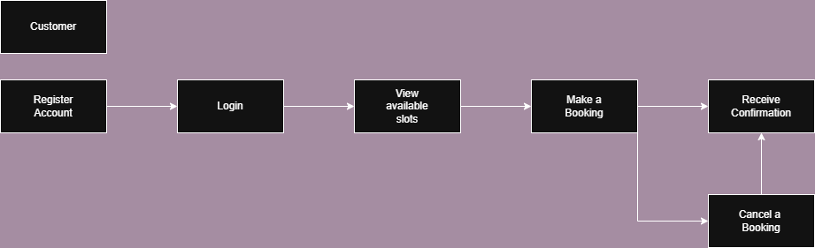

# Requirement Analysis in Software Development

## Introduction

This repository is dedicated to exploring the critical phase of Requirement Analysis in the Software Development Life Cycle (SDLC). It serves as a structured guide for documenting, analyzing, and modeling software requirements for a Booking Management System. Through this project, we aim to simulate real-world requirement analysis tasks that enable developers to effectively translate business needs into clear, actionable specifications for software development.

## What is Requirement Analysis?

Requirement Analysis is a critical phase in the Software Development Life Cycle (SDLC) that involves identifying, documenting, and managing the needs and expectations of stakeholders for a software system. It serves as the foundation upon which the entire software project is built.

During this phase, software engineers and business analysts engage with stakeholders—including clients, users, and developers—to gather both functional and non-functional requirements. These requirements define what the system should do (functional) and how the system should perform (non-functional), such as performance, usability, and reliability.

### Importance in the SDLC

- **Clarity and Alignment:** Requirement Analysis ensures all stakeholders have a shared understanding of the system’s goals, reducing ambiguity and misunderstandings.
- **Scope Definition:** Clearly outlines the project scope, helping avoid scope creep and uncontrolled changes during development.
- **Improved Planning:** Enables better estimation of time, resources, and cost by providing a clear project blueprint.
- **Risk Reduction:** Identifying potential issues early helps mitigate risks before development begins.
- **Quality Assurance:** Sets the criteria for testing and validation, ensuring that the final product meets user needs and expectations.

In essence, Requirement Analysis acts as the blueprint for successful software development. A well-defined requirements phase significantly increases the likelihood of project success by guiding design, development, and testing efforts in a structured and systematic way.

## Why is Requirement Analysis Important?

Requirement Analysis plays a pivotal role in the success of any software development project. Here are three key reasons why it is essential in the Software Development Life Cycle (SDLC):

### 1. Ensures Clear Understanding of Project Goals
Requirement Analysis facilitates thorough communication between stakeholders and the development team. By clearly documenting what the system should do, it prevents confusion, reduces assumptions, and aligns the project with business objectives.

### 2. Helps Define Scope and Prevent Scope Creep
By identifying all requirements early in the project, Requirement Analysis sets boundaries for what the software will deliver. This clarity helps avoid scope creep—uncontrolled changes or continuous growth in a project’s scope—which can delay delivery and inflate costs.

### 3. Improves Planning and Resource Allocation
With clearly defined requirements, project managers can create more accurate timelines, allocate the right resources, and estimate budgets effectively. It also allows for early identification of potential risks, leading to proactive mitigation strategies.

In summary, Requirement Analysis lays the groundwork for informed decision-making and structured development, significantly increasing the chances of project success.

## Key Activities in Requirement Analysis

Requirement Analysis involves several interconnected activities that collectively ensure a complete and accurate understanding of what the software system must achieve. The five key activities are:

- **Requirement Gathering**
  - This activity involves collecting initial information from stakeholders such as clients, users, and subject matter experts. It focuses on understanding the business context, goals, and high-level needs of the system.

- **Requirement Elicitation**
  - Elicitation goes deeper than gathering—it focuses on actively engaging stakeholders to uncover detailed, often unspoken requirements. Techniques include interviews, questionnaires, workshops, brainstorming, and observation.

- **Requirement Documentation**
  - All gathered and elicited requirements are structured and recorded in formal documentation. This may include Software Requirement Specification (SRS) documents, user stories, or requirement traceability matrices.

- **Requirement Analysis and Modeling**
  - In this phase, requirements are reviewed for consistency, completeness, and feasibility. This also includes creating models such as use case diagrams, process flows, or data flow diagrams to visualize system behavior and structure.

- **Requirement Validation**
  - This final step ensures that the documented requirements accurately reflect stakeholder needs and that there are no ambiguities, contradictions, or missing elements. Validation may involve reviews, walkthroughs, or formal inspections with stakeholders.

Together, these activities form a comprehensive process to bridge the gap between stakeholder expectations and a technically sound system design.

## Types of Requirements

In software engineering, requirements are generally categorized into two main types: Functional and Non-functional. Understanding the difference between them is essential for building a system that not only works correctly but also performs well under real-world conditions.

### 🔹 Functional Requirements

Functional requirements define **what** the system should do. These are the core features and operations the system must perform to meet user needs and business goals.

**Examples for the Booking Management System:**
- Users should be able to register and log into their accounts.
- Admins can create, update, and delete booking slots.
- Customers can view available booking slots and reserve a time slot.
- The system should send confirmation emails to users after successful bookings.
- The admin dashboard should display a real-time list of all active bookings.

### 🔸 Non-functional Requirements

Non-functional requirements describe **how** the system performs its functions. These are often related to system quality, user experience, and operational aspects.

**Examples for the Booking Management System:**
- The system should respond to user actions within 2 seconds.
- The application should be available 99.9% of the time (high availability).
- User data must be encrypted and securely stored.
- The system should support at least 1,000 concurrent users without performance degradation.
- The interface should be accessible to users with disabilities (WCAG compliance).

Understanding and documenting both types of requirements ensures the system is not only functionally complete but also robust, scalable, and user-friendly.

## Use Case Diagrams

Use Case Diagrams are a type of behavioral diagram defined by the Unified Modeling Language (UML). They visually represent the interactions between **actors** (users or external systems) and the **system** itself, capturing the system’s functionality from the end-user’s perspective.

### 📌 Benefits of Use Case Diagrams:
- Help identify system boundaries and user roles.
- Provide a clear understanding of system functionality.
- Serve as a communication tool between stakeholders and developers.
- Assist in validating the scope of the system.

### 🎯 Use Case Diagram for Booking Management System

The following diagram illustrates the major actors and use cases involved in a simple booking management system.

## Acceptance Criteria

Acceptance Criteria are predefined requirements or conditions that a software feature must meet to be accepted by stakeholders or end-users. They ensure that the development team understands exactly what is expected and help prevent misunderstandings and rework.

### 🎯 Importance of Acceptance Criteria:
- Provide a **clear definition of done** for each feature.
- Align expectations between developers, testers, and stakeholders.
- Serve as the basis for **user acceptance testing (UAT)**.
- Help ensure that features deliver **business value** and function as intended.
- Support **test case development** and enhance software quality.

### ✅ Example: Acceptance Criteria for Checkout Feature

**Feature**: Checkout in Booking Management System

**Acceptance Criteria:**
- The user must be able to review all booking details before confirming the checkout.
- The system must display a total cost including taxes and fees.
- The user must be able to select a payment method (e.g., credit card, PayPal).
- A confirmation message must be shown after successful payment.
- The system should send a confirmation email to the user upon successful checkout.
- If payment fails, an error message should be displayed and the user should be prompted to try again.

By clearly defining acceptance criteria, teams can ensure that the developed feature meets functional and user expectations, leading to a more predictable and successful delivery.

